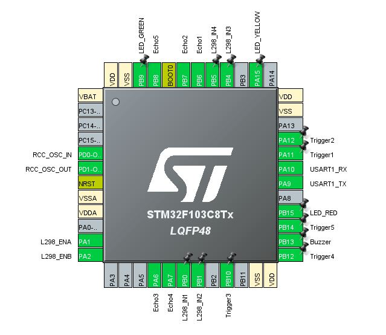

# ADAS-project-using-STM32f103c8t6
Advanced driver assistance system project based on AI & Embedded systems.

Here's a brief of most important features and peripherals used.

---

# Advanced driver assistance system

This project implements an Advanced Driver Assistance System (ADAS) using an STM32 microcontroller.
The system provides functionalities like obstacle avoidance, blind spot detection, and adaptive cruise control. It controls 4 DC motors to navigate and respond to various sensor inputs while communicating over UART.

## Features

- **Manual Control**: Move the car forward, backward, left, and right.
- **Speed Control**: Controls the speed of the vehicle with predefined speed levels.
- **Alarm System**: >>*Low-Level Alarm*: Indicated by green LED.
                    >> *Medium-Level Alarm*: Indicated by yellow LED.
                    >> *High-Level Alarm*: Indicated by red LED and buzzer.
- **Obstacle Avoidance**: Automatically detects obstacles and maneuvers the vehicle to avoid them using data from the ultrasonic sensors.
- **Blind Spot Detection**: Detects objects in the blind spots (right and left) and provides appropriate alerts.
- **Adaptive cruise control**: Adjusts the speed of the vehicle to maintain a safe distance from obstacles in front.
- **UART Communication**: >> *Sending Data*: Sends strings and floats over UART in blocking mode for debugging and monitoring.
                          >> *Receiving Data*: Receives commands in interrupt mode to control the state of the vehicle.

## Peripherals

- **UART**: Used for communication and receiving commands.
- **Timers**: Used for handling ultrasonic sensor triggers and motor control.
- **Ultrasonic Sensors**: Used for distance measurement.
- **DC Motors**: Used for moving the car in different directions and to control the speed.
- **Buzzer**: Used for sound alerting.
- **LEDs**: Used for light alerting.

## Function Prototypes and Descriptions

### Initialization Functions

```c
static void Sys_Init(void);
```
Initializes the system peripherals including ultrasonic sensors, motors, LEDs, and buzzer.

```c
void UART_Receiving_Init(void);
```
Initializes UART for receiving data in interrupt mode.

### Movement Functions

```c
void move_forward(uint16_t SpeedF);
```
Moves the car forward.

```c
void move_backward(uint16_t SpeedB);
```
Moves the car backward.

```c
void move_right(uint16_t SpeedR);
```
Moves the car to the right.

```c
void move_left(uint16_t SpeedL);
```
Moves the car to the left.

```c
void stop(void);
```
Stops the car.

### Control Functions

```c
void Speed_Control(uint16_t Speed1, uint16_t Speed2);
```
Controls the speed of the car.

### Logic Functions

```c
void Obdtacle_Avoidance(float Front_Distance, float Right_Distance, float Left_Distance);
```
Performs obstacle avoidance logic based on distance measurements from the sensors.

```c
void Adaptive_Cruise_Control(float Safe_Distance);
```
Maintains a safe distance from obstacles and controls the speed accordingly.

```c
void BlindSpot_Detection(float BlindSpot_right, float BlindSpot_left);
```
Monitors blind spots and triggers the buzzer if an object is detected.

### UART Communication Functions

```c
void UART_SendString(char *string);
```
Sends a string over UART.

```c
void UART_SendFloat(float num);
```
Sends a float value over UART as a string.

### Callback Functions

```c
void HAL_TIM_IC_CaptureCallback(TIM_HandleTypeDef *htim);
```
Handles input capture interrupts for ultrasonic sensors.

```c
void HAL_TIM_PeriodElapsedCallback(TIM_HandleTypeDef* htim);
```
Handles timer period elapsed interrupts for ultrasonic sensors.

```c
void SysTick_CallBack(void);
```
Handles SysTick interrupts for periodic ultrasonic sensor triggering.

```c
void HAL_UART_RxCpltCallback(UART_HandleTypeDef *huart);
```
Handles UART receive complete interrupts and processes incoming commands.

## Usage

1. Clone the repository to your local machine.
2. Open the project in your preferred IDE (e.g., STM32CubeIDE).
3. Connect the necessary peripherals as described in the Pinout_CubeMX.JPG down below.



4. Build and flash the project to your STM32 microcontroller.
5. Use a UART terminal to send commands to the car:
   - 'F': Move forward
   - 'B': Move backward
   - 'R': Move right
   - 'L': Move left
   - 'S': Stop
   - 'O': Enable obstacle avoidance
   - 'D': Enable blind spot safe distance monitoring.
   - 'Q': Low speed
   - 'W': Speed level 1
   - 'X': Speed level 2
   - 'Y': Speed level 3
   - 'U': High speed
7. Try the code on the simulation in "Simulation" directory.
8. If you want to deal with the H.W: >> Download our application on your mobile phone so that you can control the car.
                                     >> Get any type of ESP families that has bluetooth and UART modules (You can purchase any H.W component from our E-commerce website).
                                     >> Connect it with the STM32 using UART and with the application using bluetooth (We have dealed with ESP32-CAM, I will provide the code later In Shaa Allah).

## Simulation

You can see here the simulation and if you pressed the img you can find the video of the simulation on my channel on YouTube.

[](https://youtu.be/wQjUKuoTerA?si=SQomSVhpP3Q2sc1S)

